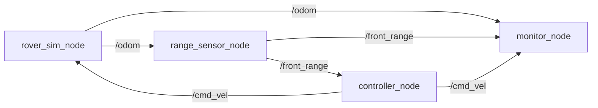

https://github.com/user-attachments/assets/7e69dded-a63d-4cf6-b85f-01e3a772facc

# ROS 2 Autonomous Rover Controller

A software-only simulated rover written in Python with ROS 2 Jazzy. A simulated
rover drives forward, "sees" an obstacle with a simulated range sensor, and
turns to avoid it. It also stops itself if the sensor stops sending data. The
whole thing runs in the terminal, no graphics needed.

I built this while teaching myself ROS 2 and Python so I could apply to
McMaster's technical robotics teams. I already had some hands-on Arduino
robotics experience (an obstacle-avoiding robot, a line follower, and a small
recycling-conveyor prototype), and I wanted to take the same idea I used
there (sense, decide, act) and rebuild it properly in ROS 2.

## Demo

The clip below is the live browser simulation: the rover drives through an
endless, procedurally generated obstacle field, steering around obstacles on its
own while the camera follows it. Every decision is made by the ROS 2 controller
node; the browser only draws the world and sends the button presses.


## Live browser simulation

Watching four nodes print numbers in a terminal is not the friendliest demo, so
I added a live 2D view that opens in a browser. It runs on top of the exact same
ROS 2 system, so my controller node still makes every decision.

How it fits together:

- A new `sim_server_node` builds an endless obstacle field around the rover
  (generated on the fly and dropped once it is far behind, so memory stays
  bounded), works out the distance to the nearest obstacle in front, and
  publishes it as the same `/front_range` message the controller already uses.
- The real `controller_node` reads that and decides drive, turn, or stop exactly
  as before, plus a small recovery move if it ever gets stuck turning in place.
- The real `rover_sim_node` turns those commands into motion and publishes
  `/odom`.
- `sim_server_node` also runs a tiny web server built only from the Python
  standard library. The browser polls it for the rover pose and obstacles and
  draws them, with the camera following the rover so the world scrolls by. The
  page's buttons (pause, restart, shuffle, speed, density) send simple requests
  back that set real ROS 2 parameters on the controller.

Honest split: the ROS 2 nodes are the robot (all decisions and motion, over real
topics); the browser is only a screen and a few buttons.

Run it:

```bash
colcon build --symlink-install
source install/setup.bash
ros2 launch rover_controller visual_sim.launch.py
```

Then open the forwarded port 8080 from the Codespaces "Ports" tab. The rover
drives and dodges obstacles for as long as you leave it running; press Ctrl+C to
stop.

## What it does

Four small programs (ROS 2 "nodes") talk to each other over named channels
("topics") to form a closed loop:

1. A **simulated rover** keeps track of its own position and heading and moves
   according to velocity commands.
2. A **range sensor** works out how far the rover is from a single obstacle and
   whether that obstacle is inside its field of view.
3. A **controller** looks at the distance and decides: keep driving if the path
   is clear, or turn if the obstacle is too close.
4. A **monitor** quietly watches everything and prints a clean status summary
   once per second.

Because the sensor's reading depends on where the rover is, and the rover's
movement depends on the controller's decision, the four nodes form a real
feedback loop rather than a one-way script.

## System architecture



The loop reads clockwise: the rover publishes where it is, the sensor turns that
into an obstacle distance, the controller turns the distance into a movement
command, and the rover moves, which changes the next sensor reading.

## Nodes

- **rover_sim_node** (`rover_sim`) is the simulated rover. It starts at the origin,
  listens for velocity commands, updates its x, y, and heading 10 times per
  second, and publishes odometry.
- **range_sensor_node** (`range_sensor`) is a simulated front-facing sensor. It
  knows where one obstacle is (fixed at x = 4.0, y = 0.0), works out the
  distance and whether the obstacle is within the sensor's field of view, and
  publishes a range reading 5 times per second.
- **controller_node** (`controller`) is the "brain". It stores the newest sensor
  reading and, on its own fixed-rate timer, decides whether to drive or turn and
  publishes a velocity command.
- **monitor_node** (`monitor`) is a read-only observer. It subscribes to all
  three topics and prints one tidy status block per second.

## Topics and message types

| Topic          | Message type              | Published by       | Used by                        |
|----------------|---------------------------|--------------------|--------------------------------|
| `/odom`        | `nav_msgs/Odometry`       | rover_sim_node     | range_sensor_node, monitor_node|
| `/front_range` | `sensor_msgs/Range`       | range_sensor_node  | controller_node, monitor_node  |
| `/cmd_vel`     | `geometry_msgs/Twist`     | controller_node    | rover_sim_node, monitor_node   |

I used standard ROS 2 message types on purpose so this project speaks the same
"language" as real robots (`/cmd_vel` and `Twist`, for example, are what a lot
of real mobile robots actually use to receive drive commands).

## Parameters

The controller uses ROS 2 parameters instead of hard-coded numbers, so its
behaviour can be tuned without editing code:

| Parameter        | Default | Meaning                                              |
|------------------|---------|------------------------------------------------------|
| `safe_distance`  | 1.0 m   | If the obstacle is closer than this, turn instead of driving. |
| `forward_speed`  | 0.5 m/s | Speed when driving forward.                          |
| `turn_speed`     | 0.8 rad/s | Turn rate when avoiding.                            |
| `control_rate`   | 10.0 Hz | How often the controller makes a decision.           |
| `sensor_timeout` | 0.75 s  | If no sensor reading arrives within this time, stop. |

You can change one live while the system runs, for example:

```bash
ros2 param set /controller_node forward_speed 0.2
```

## Control behaviour

The controller runs on a fixed 10 Hz timer. Every 0.1 seconds it checks the
newest range reading and picks one of these:

- No reading yet → `WAITING FOR SENSOR` (publishes zero velocity, so the rover
  stays put).
- Path clear (`range > safe_distance`) → `DRIVE FORWARD`.
- Obstacle close (`range <= safe_distance`) → `TURN LEFT`.

## Safety behaviour

This was the part I cared about most. Instead of deciding *only* when a sensor
message arrives, the controller decides on its own clock and checks how old the
newest reading is. If no new reading has arrived for `sensor_timeout` (0.75 s),
it publishes a zero velocity command and logs `SENSOR TIMEOUT - STOP`.

Why this matters: if the sensor node crashed and the controller only reacted to
incoming messages, the rover would keep obeying its last command forever and
could drive straight into something. The timer-based design means a dead sensor
makes the rover stop, not keep going. I tested this by killing only the sensor
node and watching the controller report `SENSOR TIMEOUT - STOP` and the rover
freeze in place.

## Setup

This project runs in a browser-based GitHub Codespace using the official
`ros:jazzy-ros-base` image, so there's nothing to install locally. The
`.devcontainer/devcontainer.json` file sets up ROS 2 Jazzy and the Python build
tools automatically when the Codespace is created.

If you open the repo in a Codespace, the workspace root is:

```
/workspaces/ros2-rover-controller
```

## Build

From the workspace root:

```bash
colcon build --symlink-install
source install/setup.bash
```

`colcon build` compiles/installs the package; `source install/setup.bash` tells
the current terminal where to find it. A new terminal needs sourcing again.

## Launch

Run all four nodes with one command:

```bash
ros2 launch rover_controller rover_system.launch.py
```

You'll see the monitor print a status block each second as the rover drives,
turns at the obstacle, and drives off in a new direction. Press `Ctrl+C` to stop.

## Recording and replaying data (rosbag)

Record the three data topics while the system runs:

```bash
ros2 bag record -o rosbag2_rover_demo /odom /front_range /cmd_vel
```

Inspect what was captured, then replay it into the monitor:

```bash
ros2 bag info rosbag2_rover_demo
ros2 run rover_controller monitor      # in one terminal
ros2 bag play rosbag2_rover_demo       # in another
```

Rosbag recordings are ignored by git (they can get large).

## Tests

The decision logic and motion math live in a pure Python module,
`rover_logic.py`, with no ROS imports. The nodes call that module, and the unit
tests test it directly, so the tests cover the real logic the robot runs, and
they run fast without starting ROS.

```bash
python3 -m pytest src/rover_controller/test/test_rover_logic.py -v
```

There are nine tests covering the drive/turn/stop decisions (including the exact
threshold and the sensor-timeout case), angle normalization, and the motion
update for both straight-line and turning motion.

## Development challenges

A few real problems I hit and worked through:

- **Local setup wouldn't cooperate.** I tried to run ROS 2 through WSL 2 on
  Windows and it repeatedly failed to create its virtual machine
  (`WslRegisterDistribution failed ... Catastrophic failure`). After a lot of
  attempts, I switched to a GitHub Codespace, which needs no local Linux install
  and just worked.
- **A graphical container that wouldn't graphics.** Before the terminal image, I
  tried a VNC desktop image; the noVNC web view kept crashing and returning 401.
  Rather than sink time into it, I dropped the GUI, since the project doesn't need one.
- **A file where I wanted a folder.** I accidentally created a *file* named
  `launch` instead of a folder, which broke the launch file path. I renamed it
  out of the way, made the real folder, and later cleaned up the leftover.
- **A tiny syntax bug with a big message.** A missing closing parenthesis in
  `setup.py` produced `SyntaxError: '(' was never closed`. I learned to read the
  actual error instead of guessing.
- **Editor warnings vs. real errors.** VS Code underlined `import rclpy` in
  yellow because its analyzer didn't know the ROS path. The build and the nodes
  ran fine, and I learned to tell an editor's yellow warning apart from a real red
  build error.

## Current limitations

I kept the scope small on purpose for a first ROS 2 project, so it's honest to
list what it does *not* do:

- One point obstacle, no real collision shape.
- Perfect odometry, with no drift, sensor noise, or covariance model.
- Instant velocity changes (no acceleration or wheel dynamics).
- 2D planar motion only.
- Simple threshold control, with no path planning, mapping, or localization.

These are intentional simplifications, not bugs.

## Future improvements

Ideas I'd try next, roughly in order:

- Add configurable sensor noise and simple filtering.
- Support multiple obstacles and pick the closest visible one.
- Smoother proportional steering instead of turn-in-place.
- Rewrite one node (probably the monitor) in C++ to make it a mixed-language
  system.
- Eventually connect the `/cmd_vel` commands to a real Arduino robot over serial.

## What I learned

- How ROS 2 nodes, topics, publishers, and subscribers fit together.
- Why splitting a system into small single-purpose nodes makes it easier to
  understand and test.
- Why a fixed-rate control loop is safer than reacting only to incoming
  messages, and why stale sensor data is dangerous.
- How to separate pure logic from framework code so it can be unit-tested.
- How to work in a Linux/ROS terminal workflow: building, sourcing, launching,
  parameters, rosbag, and git.
